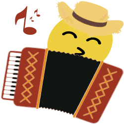

# emojis-mastodon

## Emojis customizados criados para a rede social _Mastodon_

Esse repositório contém emojis criados para algumas instâncias brasileiras do **Mastodon**. O [Mastodon][mastodon] é uma rede de _microblogging_ descentralizada que permite que seus usuários possam criar emojis próprios e colocarem em suas instâncias. Os emojis já estão no formato e tamanho adequado para serem utilizados na versão 4.0 do Mastodon (máximo de 250 Kb) e muitos deles representam particularidades específicas das instâncias brasileiras ou regionalismos. Alguns estão no formato animado (.apng) e têm a letra "A" anexada ao final do nome como _lagartear-A.png_.

Não posso garantir que a visualização funcione corretamente em todas as instâncias pois há uma diversidade de temas e tipos de telas. Porém, costumo testar os emojis com as seguintes cores de plano de fundo:

- #ffffff, #eff3f5, #d9e1e8, #e6ebf0: cores do plano de fundo no tema **Diurno** do Mastodon;
- #313543, #282c37, #191b22, #1f232b, #000000: cores do plano de fundo nos temas **Noturno** e **Alto Contraste** do Mastodon;
- #314335, #1f2b23, #19221b, #28372c: cores do plano de fundo da instância masto.donte.com.br.

Caso deseje testar um emoji com essas cores há um modelo SVG com todos esses planos de fundo no repositório também.

Os emojis que não foram criados "do zero" são adaptações do projeto [OpenMoji][openmoji], projeto de ícones e emojis open-source com licença [CC BY-SA 4.0][cc0].

[//]: # 'Links utilizados no texto'
[mastodon]: https://joinmastodon.org/
[openmoji]: https://openmoji.org/
[cc0]: https://creativecommons.org/licenses/by-sa/4.0/#

---

#### Tabela de Emojis

  <table>
        <!-- <tr>
          <th bgcolor="ffffff" colspan="6">Tabela</th>
        </tr> -->
        <tr align="center">
          <th bgcolor="d7f0d0">N°</th>
          <th bgcolor="d7f0d0">Emoji</th>
          <th bgcolor="d7f0d0">Descrição</th>
          <th bgcolor="d7f0d0">Animado</th>
          <th bgcolor="d7f0d0">Categoria</th>
          <th bgcolor="d7f0d0">Autore</th>
        </tr>
        <tr>
          <th bgcolor="f1f1f1">1</th>
          <td bgcolor="f1f1f1" align="center"></td>
          <td bgcolor="f1f1f1">Emoji com chapéu de cangaceiro</td>
          <td bgcolor="f1f1f1" align="center">Não</td>
          <td bgcolor="f1f1f1" align="center">Cuscuz.in</td>
          <td bgcolor="f1f1f1" align="center"><a href="https://github.com/thargonion">Pedro</a></td>
        </tr>
        <tr>
          <th bgcolor="f1f1f1">2</th>
          <td bgcolor="f1f1f1" align="center"></td>
          <td bgcolor="f1f1f1">Emoji tocando sanfona</td>
          <td bgcolor="f1f1f1" align="center">Não</td>
          <td bgcolor="f1f1f1" align="center">Cuscuz.in</td>
          <td bgcolor="f1f1f1" align="center"><a href="https://github.com/thargonion">Pedro</a></td>
        </tr>
        <tr>
          <th bgcolor="f1f1f1">3</th>
          <td bgcolor="f1f1f1" align="center"></td>
          <td bgcolor="f1f1f1">Emoji tocando sanfona</td>
          <td bgcolor="f1f1f1" align="center">Sim</td>
          <td bgcolor="f1f1f1" align="center">Cuscuz.in</td>
          <td bgcolor="f1f1f1" align="center"><a href="https://github.com/thargonion">Pedro</a></td>
        </tr>
        <tr>
          <th bgcolor="f1f1f1">4</th>
          <td bgcolor="f1f1f1" align="center"></td>
          <td bgcolor="f1f1f1">Logo Mastodon modificado: Cuscuz.in</td>
          <td bgcolor="f1f1f1" align="center">Não</td>
          <td bgcolor="f1f1f1" align="center">Cuscuz.in</td>
          <td bgcolor="f1f1f1" align="center"><a href="https://github.com/thargonion">Pedro</a></td>
        </tr>
		<tr>
          <th bgcolor="f1f1f1">5</th>
          <td bgcolor="f1f1f1" align="center"></td>
          <td bgcolor="f1f1f1">Um guaiamum (caranguejo) com sombrinha e roupas do frevo.</td>
          <td bgcolor="f1f1f1" align="center">Não</td>
          <td bgcolor="f1f1f1" align="center">Cuscuz.in</td>
          <td bgcolor="f1f1f1" align="center"><a href="https://github.com/thargonion">Pedro</a></td>
        </tr>
        <tr>
          <th bgcolor="f1f1f1">6</th>
          <td bgcolor="f1f1f1" align="center"></td>
          <td bgcolor="f1f1f1">Uma mandioca</td>
          <td bgcolor="f1f1f1" align="center">Não</td>
          <td bgcolor="f1f1f1" align="center">Comida</td>
          <td bgcolor="f1f1f1" align="center"><a href="https://github.com/abacaxi-queer">Abacaxi</a></td>
        </tr>      
  </table>
