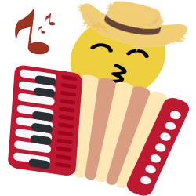
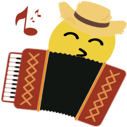
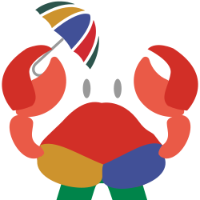
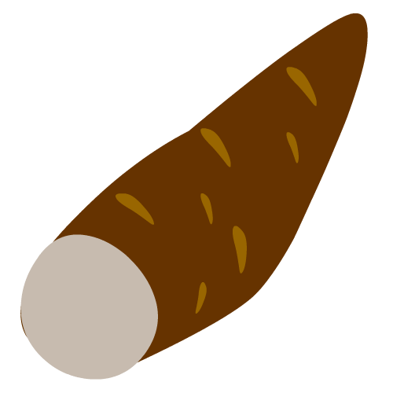
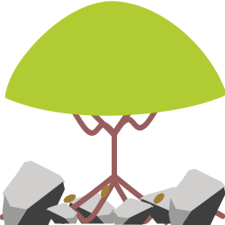
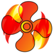

# emojis-mastodon

## Emojis customizados criados para a rede social _Mastodon_

Esse repositório contém emojis criados para algumas instâncias brasileiras do **Mastodon**. O [Mastodon][mastodon] é uma rede de _microblogging_ descentralizada que permite que seus usuários possam criar emojis próprios e colocarem em suas instâncias. Os emojis já estão no formato e tamanho adequado para serem utilizados na versão 4.0 do Mastodon (máximo de 250 Kb) e muitos deles representam particularidades específicas das instâncias brasileiras ou regionalismos. Alguns estão no formato animado (.apng) e têm a letra "A" anexada ao final do nome como _lagartear-A.png_.

Não posso garantir que a visualização funcione corretamente em todas as instâncias pois há uma diversidade de temas e tipos de telas. Porém, costumo testar os emojis com as seguintes cores de plano de fundo:

- #ffffff, #eff3f5, #d9e1e8, #e6ebf0: cores do plano de fundo no tema **Diurno** do Mastodon;
- #313543, #282c37, #191b22, #1f232b, #000000: cores do plano de fundo nos temas **Noturno** e **Alto Contraste** do Mastodon;
- #314335, #1f2b23, #19221b, #28372c: cores do plano de fundo da instância masto.donte.com.br.

Caso deseje testar um emoji com essas cores há um modelo SVG com todos esses planos de fundo no repositório também.

Os emojis que não foram criados "do zero" são adaptações do projeto [OpenMoji][openmoji], projeto de ícones e emojis open-source com licença [CC BY-SA 4.0][cc0].

[//]: # 'Links utilizados no texto'
[mastodon]: https://joinmastodon.org/
[openmoji]: https://openmoji.org/
[cc0]: https://creativecommons.org/licenses/by-sa/4.0/#

---

#### Tabela de Emojis

  <table>
        <!-- <tr>
          <th bgcolor="ffffff" colspan="6">Tabela</th>
        </tr> -->
        <tr align="center">
          <th bgcolor="d7f0d0">N°</th>
          <th bgcolor="d7f0d0">Emoji</th>
          <th bgcolor="d7f0d0">Descrição</th>
          <th bgcolor="d7f0d0">Animado</th>
          <th bgcolor="d7f0d0">Categoria</th>
          <th bgcolor="d7f0d0">Autore</th>
        </tr>
        <tr>
          <th bgcolor="f1f1f1">1</th>
          <td bgcolor="f1f1f1" align="center"></td>
          <td bgcolor="f1f1f1">Emoji com chapéu de cangaceiro</td>
          <td bgcolor="f1f1f1" align="center">Não</td>
          <td bgcolor="f1f1f1" align="center">Cuscuz.in</td>
          <td bgcolor="f1f1f1" align="center"><a href="https://github.com/thargonion">Pedro</a></td>
        </tr>
        <tr>
          <th bgcolor="f1f1f1">2</th>
          <td bgcolor="f1f1f1" align="center"></td>
          <td bgcolor="f1f1f1">Emoji tocando sanfona</td>
          <td bgcolor="f1f1f1" align="center">Não</td>
          <td bgcolor="f1f1f1" align="center">Cuscuz.in</td>
          <td bgcolor="f1f1f1" align="center"><a href="https://github.com/thargonion">Pedro</a></td>
        </tr>
        <tr>
          <th bgcolor="f1f1f1">3</th>
          <td bgcolor="f1f1f1" align="center"></td>
          <td bgcolor="f1f1f1">Emoji tocando sanfona</td>
          <td bgcolor="f1f1f1" align="center">Sim</td>
          <td bgcolor="f1f1f1" align="center">Cuscuz.in</td>
          <td bgcolor="f1f1f1" align="center"><a href="https://github.com/thargonion">Pedro</a></td>
        </tr>
        <tr>
          <th bgcolor="f1f1f1">4</th>
          <td bgcolor="f1f1f1" align="center"></td>
          <td bgcolor="f1f1f1">Logo Mastodon modificado: Cuscuz.in</td>
          <td bgcolor="f1f1f1" align="center">Não</td>
          <td bgcolor="f1f1f1" align="center">Cuscuz.in</td>
          <td bgcolor="f1f1f1" align="center"><a href="https://github.com/thargonion">Pedro</a></td>
        </tr>
		<tr>
          <th bgcolor="f1f1f1">5</th>
          <td bgcolor="f1f1f1" align="center"></td>
          <td bgcolor="f1f1f1">Um guaiamum (caranguejo) com sombrinha e roupas do frevo.</td>
          <td bgcolor="f1f1f1" align="center">Não</td>
          <td bgcolor="f1f1f1" align="center">Cuscuz.in</td>
          <td bgcolor="f1f1f1" align="center"><a href="https://github.com/thargonion">Pedro</a></td>
        </tr>
        <tr>
          <th bgcolor="f1f1f1">6</th>
          <td bgcolor="f1f1f1" align="center"></td>
          <td bgcolor="f1f1f1">Uma mandioca</td>
          <td bgcolor="f1f1f1" align="center">Não</td>
          <td bgcolor="f1f1f1" align="center">Comida</td>
          <td bgcolor="f1f1f1" align="center"><a href="https://github.com/abacaxi-queer">Abacaxi</a></td>
        </tr> 
		<tr>
          <th bgcolor="f1f1f1">7</th>
          <td bgcolor="f1f1f1" align="center"></td>
          <td bgcolor="f1f1f1">Ligado nos 220.</td>
          <td bgcolor="f1f1f1" align="center">Não</td>
          <td bgcolor="f1f1f1" align="center">Cuscuz.in</td>
          <td bgcolor="f1f1f1" align="center"><a href="https://github.com/thargonion">Pedro</a></td>
        </tr>
		<tr>
          <th bgcolor="f1f1f1">8</th>
          <td bgcolor="f1f1f1" align="center"></td>
          <td bgcolor="f1f1f1">Ligado nos 220 com raios.</td>
          <td bgcolor="f1f1f1" align="center">Sim</td>
          <td bgcolor="f1f1f1" align="center">Cuscuz.in</td>
          <td bgcolor="f1f1f1" align="center"><a href="https://github.com/thargonion">Pedro</a></td>
        </tr>	
	<tr>
          <th bgcolor="f1f1f1">9</th>
          <td bgcolor="f1f1f1" align="center"></td>
          <td bgcolor="f1f1f1">Um umbuzeiro crescendo entre rochas.</td>
          <td bgcolor="f1f1f1" align="center">Não</td>
          <td bgcolor="f1f1f1" align="center">Cuscuz.in</td>
          <td bgcolor="f1f1f1" align="center"><a href="https://github.com/thargonion">Pedro</a></td>
        </tr>	
	<tr>
          <th bgcolor="f1f1f1">10</th>
          <td bgcolor="f1f1f1" align="center"></td>
          <td bgcolor="f1f1f1">Um eita!</td>
          <td bgcolor="f1f1f1" align="center">Não</td>
          <td bgcolor="f1f1f1" align="center">Cuscuz.in</td>
          <td bgcolor="f1f1f1" align="center"><a href="https://github.com/thargonion">Pedro</a></td>
        </tr>	
	<tr>
          <th bgcolor="f1f1f1">11</th>
          <td bgcolor="f1f1f1" align="center"></td>
          <td bgcolor="f1f1f1">Lagartear. Um lagarto descansando sob o sol e mudando de cor.</td>
          <td bgcolor="f1f1f1" align="center">Não</td>
          <td bgcolor="f1f1f1" align="center">Cuscuz.in</td>
          <td bgcolor="f1f1f1" align="center"><a href="https://github.com/thargonion">Pedro</a></td>
        </tr>	
	<tr>
          <th bgcolor="f1f1f1">12</th>
          <td bgcolor="f1f1f1" align="center"></td>
          <td bgcolor="f1f1f1">Oxe!</td>
          <td bgcolor="f1f1f1" align="center">Não</td>
          <td bgcolor="f1f1f1" align="center">Cuscuz.in</td>
          <td bgcolor="f1f1f1" align="center"><a href="https://github.com/thargonion">Pedro</a></td>
        </tr>	
		<tr>
          <th bgcolor="f1f1f1">13</th>
          <td bgcolor="f1f1f1" align="center"></td>
          <td bgcolor="f1f1f1">Um ventilador que ao invés de refrescar com vento lança uma brisa de fogo. </td>
          <td bgcolor="f1f1f1" align="center">Sim</td>
          <td bgcolor="f1f1f1" align="center">Cuscuz.in</td>
          <td bgcolor="f1f1f1" align="center"><a href="https://github.com/thargonion">Pedro</a></td>
        </tr>
		<tr>
          <th bgcolor="f1f1f1">13</th>
          <td bgcolor="f1f1f1" align="center"></td>
          <td bgcolor="f1f1f1">Égua!</td>
          <td bgcolor="f1f1f1" align="center">Não</td>
          <td bgcolor="f1f1f1" align="center">Cuscuz.in</td>
          <td bgcolor="f1f1f1" align="center"><a href="https://github.com/thargonion">Pedro</a></td>
        </tr>
		<tr>
          <th bgcolor="f1f1f1">13</th>
          <td bgcolor="f1f1f1" align="center"></td>
          <td bgcolor="f1f1f1">A Vovó Juju do desenho Irmão de Jorel.</td>
          <td bgcolor="f1f1f1" align="center">Não</td>
          <td bgcolor="f1f1f1" align="center">Desenhos animados</td>
          <td bgcolor="f1f1f1" align="center"><a href="https://github.com/abacaxi-queer">Abacaxi</a></td>
        </tr>
		<tr>
          <th bgcolor="f1f1f1">14</th>
          <td bgcolor="f1f1f1" align="center"></td>
          <td bgcolor="f1f1f1">Símbolo de dominação de ar do desenho Avatar: A Lenda de Aang</td>
          <td bgcolor="f1f1f1" align="center">Não</td>
          <td bgcolor="f1f1f1" align="center">Desenhos animados</td>
          <td bgcolor="f1f1f1" align="center"><a href="https://github.com/thargonion">Pedro</a></td>
        </tr>
		<tr>
          <th bgcolor="f1f1f1">15</th>
          <td bgcolor="f1f1f1" align="center"></td>
          <td bgcolor="f1f1f1">Símbolo dos Nômades do Ar do desenho Avatar: A Lenda de Aang</td>
          <td bgcolor="f1f1f1" align="center">Não</td>
          <td bgcolor="f1f1f1" align="center">Desenhos animados</td>
          <td bgcolor="f1f1f1" align="center"><a href="https://github.com/thargonion">Pedro</a></td>
        </tr>
		<tr>
          <th bgcolor="f1f1f1">16</th>
          <td bgcolor="f1f1f1" align="center"></td>
          <td bgcolor="f1f1f1">Símbolo da dominação de terra do desenho Avatar: A Lenda de Aang</td>
          <td bgcolor="f1f1f1" align="center">Não</td>
          <td bgcolor="f1f1f1" align="center">Desenhos animados</td>
          <td bgcolor="f1f1f1" align="center"><a href="https://github.com/thargonion">Pedro</a></td>
        </tr>
		<tr>
          <th bgcolor="f1f1f1">17</th>
          <td bgcolor="f1f1f1" align="center"></td>
          <td bgcolor="f1f1f1">Símbolo do Reino da Terra do desenho Avatar: A Lenda de Aang</td>
          <td bgcolor="f1f1f1" align="center">Não</td>
          <td bgcolor="f1f1f1" align="center">Desenhos animados</td>
          <td bgcolor="f1f1f1" align="center"><a href="https://github.com/thargonion">Pedro</a></td>
        </tr>
		<tr>
          <th bgcolor="f1f1f1">18</th>
          <td bgcolor="f1f1f1" align="center"></td>
          <td bgcolor="f1f1f1">Símbolo da dominação de fogo do desenho Avatar: A Lenda de Aang</td>
          <td bgcolor="f1f1f1" align="center">Não</td>
          <td bgcolor="f1f1f1" align="center">Desenhos animados</td>
          <td bgcolor="f1f1f1" align="center"><a href="https://github.com/thargonion">Pedro</a></td>
        </tr>
		<tr>
          <th bgcolor="f1f1f1">19</th>
          <td bgcolor="f1f1f1" align="center"></td>
          <td bgcolor="f1f1f1">Símbolo da Nação do Fogo do desenho Avatar: A Lenda de Aang</td>
          <td bgcolor="f1f1f1" align="center">Não</td>
          <td bgcolor="f1f1f1" align="center">Desenhos animados</td>
          <td bgcolor="f1f1f1" align="center"><a href="https://github.com/thargonion">Pedro</a></td>
        </tr>
		<tr>
          <th bgcolor="f1f1f1">20</th>
          <td bgcolor="f1f1f1" align="center"></td>
          <td bgcolor="f1f1f1">Símbolo da dominação de água do desenho Avatar: A Lenda de Aang</td>
          <td bgcolor="f1f1f1" align="center">Não</td>
          <td bgcolor="f1f1f1" align="center">Desenhos animados</td>
          <td bgcolor="f1f1f1" align="center"><a href="https://github.com/thargonion">Pedro</a></td>
        </tr>
		<tr>
          <th bgcolor="f1f1f1">21</th>
          <td bgcolor="f1f1f1" align="center"></td>
          <td bgcolor="f1f1f1">Símbolo da Tribo da Água do desenho Avatar: A Lenda de Aang</td>
          <td bgcolor="f1f1f1" align="center">Não</td>
          <td bgcolor="f1f1f1" align="center">Desenhos animados</td>
          <td bgcolor="f1f1f1" align="center"><a href="https://github.com/thargonion">Pedro</a></td>
        </tr>
		<tr>
          <th bgcolor="f1f1f1">22</th>
          <td bgcolor="f1f1f1" align="center"></td>
          <td bgcolor="f1f1f1">Um emoji de um coração dividido ao meio pelas cores azul e vermelho com um jogador de basquete no centro.</td>
          <td bgcolor="f1f1f1" align="center">Não</td>
          <td bgcolor="f1f1f1" align="center">Esportes: basquete</td>
          <td bgcolor="f1f1f1" align="center"><a href="https://github.com/thargonion">Pedro</a></td>
        </tr>
		<tr>
          <th bgcolor="f1f1f1">23</th>
          <td bgcolor="f1f1f1" align="center"></td>
          <td bgcolor="f1f1f1">Brasão da Confederação Brasileira de Futebol.</td>
          <td bgcolor="f1f1f1" align="center">Não</td>
          <td bgcolor="f1f1f1" align="center">Esportes: times de futebol</td>
          <td bgcolor="f1f1f1" align="center"><a href="https://github.com/thargonion">Pedro</a></td>
        </tr>
		<tr>
          <th bgcolor="f1f1f1">24</th>
          <td bgcolor="f1f1f1" align="center"></td>
          <td bgcolor="f1f1f1">Brasão da Confederação Brasileira de Futebol sem as 5 estrelas.</td>
          <td bgcolor="f1f1f1" align="center">Não</td>
          <td bgcolor="f1f1f1" align="center">Esportes: times de futebol</td>
          <td bgcolor="f1f1f1" align="center"><a href="https://github.com/thargonion">Pedro</a></td>
        </tr>
		<tr>
          <th bgcolor="f1f1f1">25</th>
          <td bgcolor="f1f1f1" align="center"></td>
          <td bgcolor="f1f1f1">Brasão do Barcelona.</td>
          <td bgcolor="f1f1f1" align="center">Não</td>
          <td bgcolor="f1f1f1" align="center">Esportes: times de futebol</td>
          <td bgcolor="f1f1f1" align="center"><a href="https://github.com/thargonion">Pedro</a></td>
        </tr>
		<tr>
          <th bgcolor="f1f1f1">26</th>
          <td bgcolor="f1f1f1" align="center"></td>
          <td bgcolor="f1f1f1">Brasão do Botafogo.</td>
          <td bgcolor="f1f1f1" align="center">Não</td>
          <td bgcolor="f1f1f1" align="center">Esportes: times de futebol</td>
          <td bgcolor="f1f1f1" align="center"><a href="https://github.com/thargonion">Pedro</a></td>
        </tr>
		<tr>
          <th bgcolor="f1f1f1">27</th>
          <td bgcolor="f1f1f1" align="center"></td>
          <td bgcolor="f1f1f1">Brasão do Chelsea.</td>
          <td bgcolor="f1f1f1" align="center">Não</td>
          <td bgcolor="f1f1f1" align="center">Esportes: times de futebol</td>
          <td bgcolor="f1f1f1" align="center"><a href="https://github.com/thargonion">Pedro</a></td>
        </tr>
		<tr>
          <th bgcolor="f1f1f1">28</th>
          <td bgcolor="f1f1f1" align="center"></td>
          <td bgcolor="f1f1f1">Brasão do Corinthias.</td>
          <td bgcolor="f1f1f1" align="center">Não</td>
          <td bgcolor="f1f1f1" align="center">Esportes: times de futebol</td>
          <td bgcolor="f1f1f1" align="center"><a href="https://github.com/thargonion">Pedro</a></td>
        </tr>
		<tr>
          <th bgcolor="f1f1f1">29</th>
          <td bgcolor="f1f1f1" align="center"></td>
          <td bgcolor="f1f1f1">Brasão do Cruzeiro.</td>
          <td bgcolor="f1f1f1" align="center">Não</td>
          <td bgcolor="f1f1f1" align="center">Esportes: times de futebol</td>
          <td bgcolor="f1f1f1" align="center"><a href="https://github.com/thargonion">Pedro</a></td>
        </tr>
		<tr>
          <th bgcolor="f1f1f1">30</th>
          <td bgcolor="f1f1f1" align="center"></td>
          <td bgcolor="f1f1f1">Brasão do Flamengo.</td>
          <td bgcolor="f1f1f1" align="center">Não</td>
          <td bgcolor="f1f1f1" align="center">Esportes: times de futebol</td>
          <td bgcolor="f1f1f1" align="center"><a href="https://github.com/thargonion">Pedro</a></td>
        </tr>
  </table>
